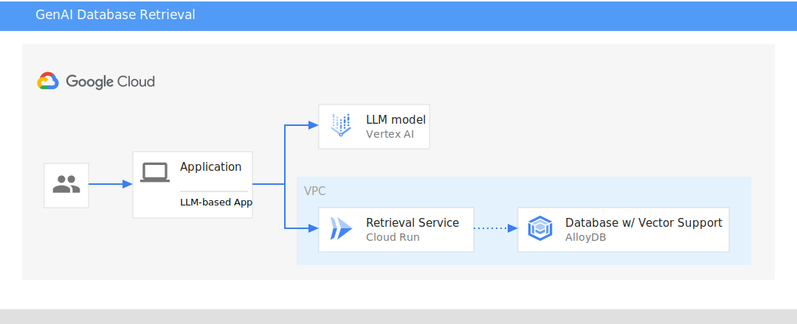

# GenAI Databases Retrieval App

Note: This project is for demonstration only and is not an officially supported
Google product.


## Introduction

This project demonstrates production-quality practices for using techniques like
[Retrieval Augmented Generation (RAG)][rag] and [ReACT][react] to extend your
Gen AI application with information from Cloud Databases. 

This demo showcases the Cymbal Air customer service assistant. Cymbal Air is a
fictional passenger airline. The assistant is an AI chatbot that helps
travellers manage flights and look up information about Cymbal Air's hub
at San Francisco International Airport (SFO).

It can help answer users questions like:
* Are there any luxury shops?
* Where can I get coffee near gate A6?
* Where can I find a gift?
* What flights are headed to NYC tomorrow?

[rag]: https://www.promptingguide.ai/techniques/rag
[react]: https://www.promptingguide.ai/techniques/react

## Table of Contents
<!-- TOC depthfrom:2 -->

- [Introduction](#introduction)
- [Table of Contents](#table-of-contents)
- [Understanding the demo](#understanding-the-demo)
    - [Understanding Retrieval Augmented Generation RAG](#understanding-retrieval-augmented-generation-rag)
    - [Using ReACT + RAG together](#using-react--rag-together)
    - [Architecture](#architecture)
- [Deploying](#deploying)
    - [Before you begin](#before-you-begin)
    - [Setting up your Database](#setting-up-your-database)
    - [Deploying the Retrieval Service](#deploying-the-retrieval-service)
    - [Running the LLM-based Application](#running-the-llm-based-application)
    - [Clean up Resources](#clean-up-resources)
- [Writing your own retrieval service](#writing-your-own-retrieval-service)

<!-- /TOC -->

## Understanding the demo

### Understanding Retrieval Augmented Generation (RAG)

One of the best tools for reducing hallucinations is to use Retrieval Augmented
Generation (RAG). RAG is the concept of retrieving some data or information,
augmenting your prompt to the LLM, and allowing it to generate more accurate
responses based on the data included in the prompt. This grounds the model’s
response, making it less likely to hallucinate. This technique is also useful
for allowing the LLM to access data it didn’t have when it was trained.  And
unlike fine-tuning, the information retrieved for RAG does not alter the model
or otherwise leave the context of the request - making it more suitable for use
cases where information privacy and security are important.

Cloud databases provide a managed solution for storing and accessing data in a
scalable and a reliable way. By connecting an LLM to a cloud database,
developers can give their applications access to a wider range of information
and reduce the risk of hallucinations.


### Using ReACT + RAG together

Another increasingly popular technique for LLMs is called ReACT Prompting. ReACT
(a combination of “Reason” and “Act”) is a technique for asking your LLM to
think through verbal reasoning. This technique establishes a framework for the
model (acting as an Agent) to “think aloud” using a specific template - things
like “Thoughts”, “Actions”, and “Observations”. 

Many platforms support similar patterns to help extend your LLM’s capabilities –
Vertex AI has Extensions, LangChain has Tools, and ChatGPT has plugins. We can
leverage this pattern to help an LLM understand what information it can access
and decide when it needs to access it. 

### Architecture



This demo contains 3 key parts:
1. **Application** -- The LLM-based app that acts as orchestrates layer for the
   interaction with the LLM.
1. **Retrieval Service** -- The retrieval service provides the application
   concrete, discrete actions that allow the LLM to interact with the Database.
1. **Database** -- The database containing the data the LLM can use to answer
   questions. For this application, the database used was intentionally designed
   to be interchangeable in order to make it easier to run this on your
   preferred database.

Running the retrieval service separately (as opposed to in the app itself) can 
help address a number of challenges 
1. **Better recall** - LLMs perform better when given smaller, discrete tasks
   they can use to accomplish larger goals. By mapping a specific action to a
   specify, pre-determined query it significantly improves the LLMs ability to
   leverage it successfully.
1. **Better scalability** - Running the retrieval as a separate service both
   allows multiple different LLMs to leverage it, as well as allowing it to
   scale independently. It allows allows production best practices such as
   connection pooling or caching.
1. **Better security** - LLMs are susceptible to attacks such as "jailbreaking"
   to circumvent safety measures that are put in place. Using an intermediary
   service allows the application to handle authentication and authorization
   through more standard and secure channels (like existing auth web frameworks).

## Deploying

Deploying this demo consists of 3 steps:
1. Setting up your Database -- creating your database and initializing it with
   data
1. Deploying your service -- deploying your retrieval service and connecting
   it to your database
1. Running the LLM-based application -- running your application locally

### Before you begin

Clone this repo to your local machine:
```bash
git clone https://github.com/GoogleCloudPlatform/genai-databases-retrieval-app.git
```

### Setting up your Database

The retrieval service uses an interchangeable 'datastore' interface. Choose one
of any of the database's listed below to set up and initialize your database:

* [Set up and configure AlloyDB with public IP](./docs/datastore/alloydb.md)
* [Set up and configure Cloud SQL](./docs/datastore/cloudsql_postgres.md)
* [Set up and configure non-cloud postgres (such as AlloyDB Omni)](./docs/datastore/postgres.md)
* [Set up and configure Firestore](./docs/datastore/firestore.md)

### Deploying the Retrieval Service

[Instructions for deploying the retrieval service](./docs/deploy_retrieval_service.md)

### Running the LLM-based Application

[Instructions for running app locally](./docs/run_llm_demo.md)

### Clean up Resources

[Instructions for cleaning up resources](./docs/clean_up.md)

## Writing your own retrieval service

This demo can also serve as a starting point for writing your own retrieval
service. The directory is organized into the following folders:

| Directory                                    | Description                                                                           |
|----------------------------------------------|---------------------------------------------------------------------------------------|
| [`data`](/data)                              | Contains CSV files with the dataset for a working demo.                               |
| [`llm_demo`](/llm_demo) | Contains an LLM-based application that that uses the retrieval service via multiple orchestrator (e.g. LangChain, VertexAI). |
| [`retrieval_service`](/retrieval_service)    | Contains the service for extending an LLM with information from the database.         |

You can copy or fork the `retrieval_service` folder to customize it to your
needs. There are two main places you want to start:
- `retrieval_service/app/routes.py` - contains the API endpoints that the LLM
  will call
- `retrieval_service/datastore/datastore.py` - contains the interface used to
  abstract the database. There are specific implementations of this in the
  `providers` folder that can be customized with logic for your specific schema.

