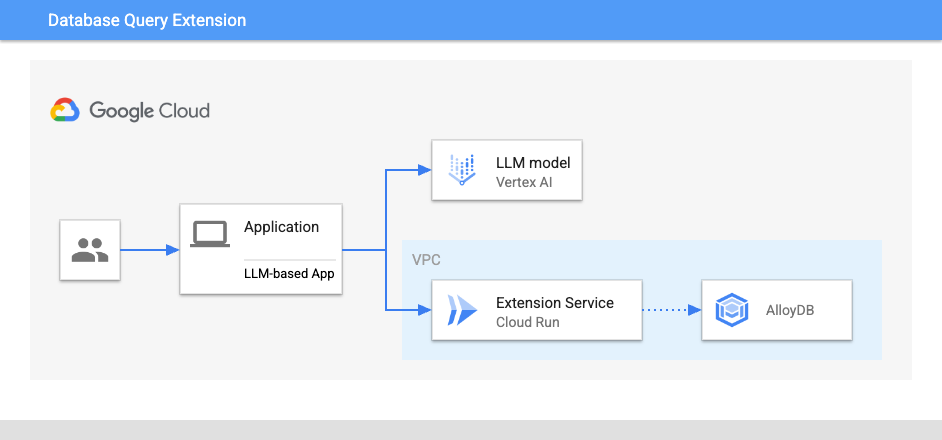

# Database Query Extension

Note: This project is experimental and is not an officially supported Google
product.

## Introduction

This project is intended to be a working demo showcasing how to extend an
LLM-based application using Cloud Databases for [Retrieval Augmented Generation
(RAG)][rag]. It's intended to both demonstrate how to best use advanced RAG
patterns with Databases, as well as provide a basic outline for extending your
own LLMs.

This demo included is an "SFO Airport Assistant": a San Francisco Airport-based
AI assistant that has access to information about airports, flights, and
amenities. It can help answer users questions like:
* Are there any luxury shops?
* Where can I get coffee near gate A6?
* Where can I find a gift?
* What flights are headed to NYC tomorrow? 

[rag]: https://www.promptingguide.ai/techniques/rag

## Table of Contents
<!-- TOC depthfrom:2 -->

- [Introduction](#introduction)
- [Table of Contents](#table-of-contents)
- [Architecture](#architecture)
    - [Overview](#overview)
    - [Extension as a service](#extension-as-a-service)
- [Deploying](#deploying)
    - [Setting up your Database](#setting-up-your-database)
    - [Deploying the Extension Service](#deploying-the-extension-service)
    - [Running the LLM-based Application](#running-the-llm-based-application)
- [Writing your own extension](#writing-your-own-extension)

<!-- /TOC -->

## Architecture 

### Overview

This demo contains 3 key parts:
1. **Application** -- The LLM-based app that acts as orchestrates layer for the
   interaction with the LLM.
1. **Extension** -- The extension service provides the application concrete,
   discrete actions that allow the LLM to interact with the Database.
1. **Database** -- The database containing the data the LLM can use to answer
   questions. For this application, the database used was intentionally designed
   to be interchangeable in order to make it easier to run this on your
   preferred database.

### Extension as a service

While it's often possible to expose similar functionality directly into your
application, running your extension service has several benefits: Running the
extension as a separate service has many benefits: 
1. **Better recall** - LLMs perform better when given smaller, discrete tasks
   they can use to accomplish larger goals. By mapping a specific action to a
   specify, pre-determined query it significantly improves the LLMs ability to
   leverage it successfully.
1. **Better scalability** - Running the extension as a separate service both
   allows multiple different LLMs to leverage it, as well as allowing it to
   scale independently. It allows allows production best practices such as
   connection pooling or caching.
1. **Better security** - LLMs are susceptible to attacks such as "jailbreaking"
   to circumvent safety measures that are put in place. Using an intermediary
   service allows the application to handle authentication and authorization
   through more standard and secure channels. 

## Deploying

Deploying this demo consists of 3 steps:
1. Setting up your Database -- creating your database and initializing it with
   data
1. Deploying your Extension -- deploying your extension service and connecting
   it to your database
1. Running the LLM-based application -- running your application locally

### Setting up your Database

The extension service uses an interchangeable 'datastore' interface. Choose one
of any of the database's listed below to set up and initialize your database:

// TODO: complete this link
* [Set up and configure AlloyDB][]

### Deploying the Extension Service

// TODO: instructions for deploying the extension service

### Running the LLM-based Application

// TODO: Instructions for running app locally

## Writing your own extension

This demo can also serve as a starting point for writing your own extension. The
directory is organized into the following folders:

| Directory                                    | Description                                                                           |
|----------------------------------------------|---------------------------------------------------------------------------------------|
| [`data`](/data)                              | Contains CSV files with the dataset for a working demo.                               |
| [`extension-service`](/extension-service)    | Contains the service for extending an LLM with information from the database.         |
| [`langchain_tools_demo`](/extension-service) | Contains an git statLLM-based application that that uses the extension service via LangChain. |

You can copy or fork the `extension-service` folder to customize it to your
needs. There are two main places you want to start:
- `extension-service/app/routes.py` - contains the API endpoints that the LLM
  will call
- `extension-service/datastore/datastore.py` - contains the interface used to
  abstract the database. There are specific implementations of this in the
  `providers` folder that can be customized with logic for your specific schema. 

